# AgentOS Architecture — Engineering Diagrams

> **Version:** 1.0.0 | All diagrams render natively on GitHub using Mermaid.
>
> This document is the definitive visual reference for the AgentOS engineering platform.
> Reference it when onboarding, reviewing architecture, or explaining the system to teammates.

---

## 1. Repository Architecture

```mermaid
graph TD
    Root["🗂 AgentOS Repository Root"] --> AI["📄 AGENTOS.md\nAI Entrypoint"]
    Root --> README["📄 README.md\nProject Overview"]
    Root --> Config["⚙️ PROJECT_CONFIG.yaml\nActive Configuration"]

    Root --> Context["📁 context/\nLive Project State"]
    Root --> Workflows["📁 workflows/\nStandard SOPs"]
    Root --> Agents["📁 agents/\nSpecialist Contracts"]
    Root --> Tools["📁 tools/\nCLI + MCP"]
    Root --> Standards["📁 standards/\nQuality Definitions"]
    Root --> Checklists["📁 checklists/\nQuality Gates"]
    Root --> Runtime["📁 runtime/\nHarness + Loop + Kernel"]
    Root --> Profiles["📁 profiles/\nProject Templates"]
    Root --> Validation["📁 validation/\nSynthetic Suite"]
    Root --> Artifacts["📁 artifacts/\nGenerated Outputs"]
    Root --> Integrations["📁 integrations/\nVendor Adapters"]
    Root --> Examples["📁 examples/\nStarter Projects"]
    Root --> GH["📁 .github/\nGitHub Templates + CI"]

    style Root fill:#1e293b,color:#fff
    style AI fill:#7c3aed,color:#fff
    style Runtime fill:#0f766e,color:#fff
    style Agents fill:#1d4ed8,color:#fff
    style Validation fill:#b45309,color:#fff
```

---

## 2. WAT Architecture (Workflows → Agents → Tools)

```mermaid
graph LR
    subgraph L1["Layer 1 — Workflows (SOPs)"]
        W1[master.md]
        W2[feature_development.md]
        W3[bug_fix.md]
        W4[research.md]
        W5[release.md]
        W6[incident_response.md]
    end

    subgraph L2["Layer 2 — Agents (Decision Makers)"]
        A1[orchestrator]
        A2[chief-architect]
        A3[planner]
        A4[ai-reviewer]
        A5[security-reviewer]
        A6[qa-reviewer]
        A7[docs-reviewer]
        A8[release-reviewer]
    end

    subgraph L3["Layer 3 — Tools (Executors)"]
        T1[harness_engine.py]
        T2[validate_agentos.py]
        T3[bootstrap_project.py]
        T4[execute_suite.py]
        T5[MCP Integrations]
    end

    L1 -->|triggers| L2
    L2 -->|invokes| L3

    style L1 fill:#1e3a5f,color:#fff
    style L2 fill:#1a3a2a,color:#fff
    style L3 fill:#3b1a1a,color:#fff
```

---

## 3. Context Loading Flow

```mermaid
flowchart TD
    Start([Session Starts]) --> ReadAG[Read AGENTOS.md]
    ReadAG --> ReadState[Read context/state.md]
    ReadState --> ReadConfig[Read PROJECT_CONFIG.yaml]
    ReadConfig --> TaskCheck{Task Type?}

    TaskCheck -->|New Project| ReadVision[Read context/vision.md]
    TaskCheck -->|Architecture| ReadArch[Read context/architecture.md\n+ context/decisions.md]
    TaskCheck -->|Feature| ReadWorkflow[Read workflows/\nfeature_development.md]
    TaskCheck -->|Bug Fix| ReadBug[Read workflows/bug_fix.md]
    TaskCheck -->|Release| ReadRelease[Read workflows/release.md]

    ReadVision --> AgentLoad{Agent Needed?}
    ReadArch --> AgentLoad
    ReadWorkflow --> AgentLoad
    ReadBug --> AgentLoad
    ReadRelease --> AgentLoad

    AgentLoad -->|Yes| LoadAgent[Load agents/{agent}.md]
    AgentLoad -->|No| Implement
    LoadAgent --> LoadStd[Load standards/{domain}.md]
    LoadStd --> Implement[Implement Task]
    Implement --> ValidateEnd[Run validate_agentos.py]
    ValidateEnd --> UpdateState[Update context/state.md]

    style Start fill:#22c55e,color:#fff
    style ValidateEnd fill:#7c3aed,color:#fff
    style UpdateState fill:#0ea5e9,color:#fff
```

---

## 4. Harness Runtime Flow

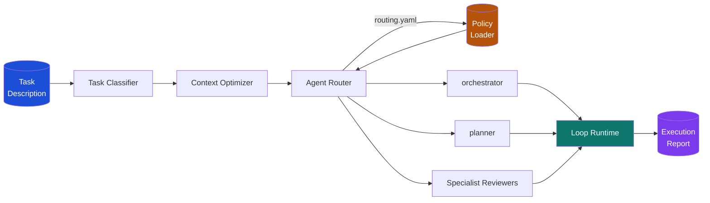

---

## 5. Loop Runtime — Internal Architecture

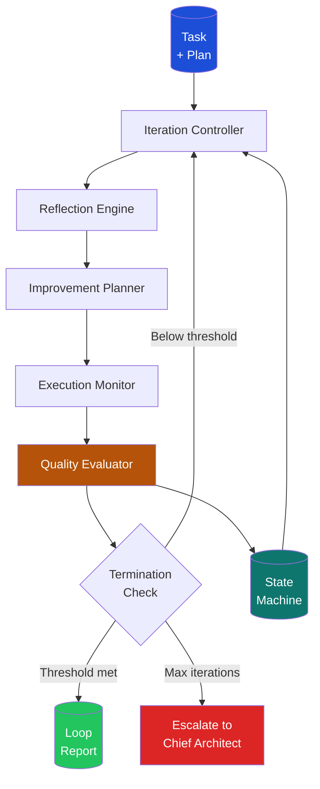

---

## 6. Agent Routing Flow

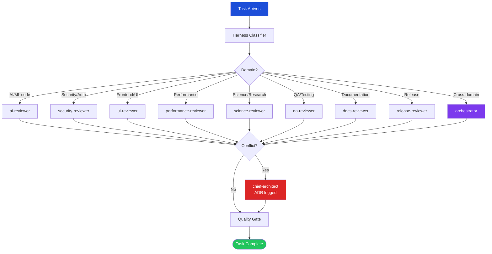

---

## 7. Quality Gate Pipeline

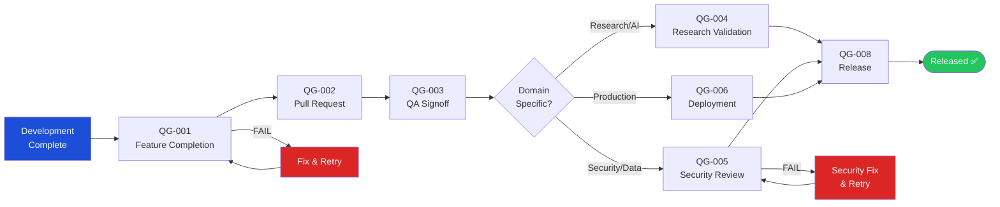

---

## 8. Bootstrap Flow

```mermaid
flowchart TD
    Clone([git clone]) --> MakeBS[make bootstrap\nor\npython3 bootstrap_project.py]
    MakeBS --> Mode{Mode?}

    Mode -->|--interactive| Int[Prompt: Name, Profile,\nGoals, Stack, Deadline]
    Mode -->|--defaults| Def[Use default ai_project\nprofile + defaults]
    Mode -->|--profile X| Prof[Load profiles/X.yaml\n+ use defaults]
    Mode -->|--config file.yaml| Cfg[Parse provided YAML\nconfiguration file]
    Mode -->|--resume| Res[Resume from\nlast checkpoint]

    Int --> Verify[Verify repository\ndirectories]
    Def --> Verify
    Prof --> Verify
    Cfg --> Verify
    Res --> Verify

    Verify --> LoadProfile[Load profiles/{profile}.yaml]
    LoadProfile --> GenConfig[Generate\nPROJECT_CONFIG.yaml]
    GenConfig --> GenContext[Generate\ncontext/vision.md\ncontext/state.md]
    GenContext --> RunVal[Run\nvalidate_agentos.py]
    RunVal --> Check{Score\n= 100?}
    Check -->|YES| Done([Bootstrap\nComplete ✅])
    Check -->|NO| Warn[Surface warnings\nto engineer]

    style Clone fill:#1d4ed8,color:#fff
    style Done fill:#22c55e,color:#fff
    style Warn fill:#f59e0b,color:#fff
```

---

## 9. Runtime Lifecycle

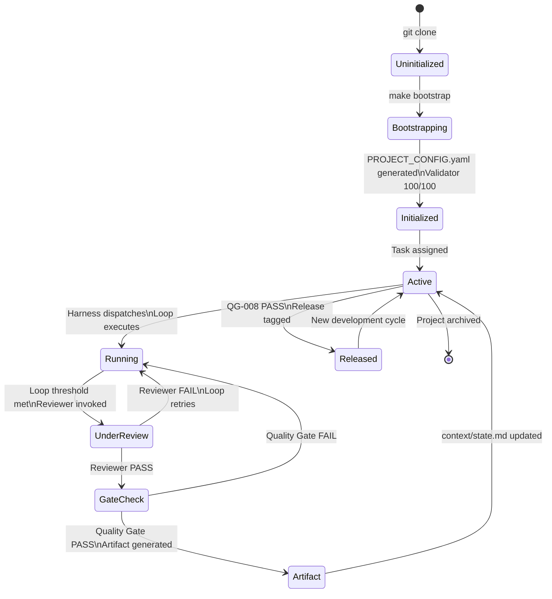

---

## 10. Project Lifecycle

```mermaid
gantt
    title AgentOS Project Lifecycle
    dateFormat X
    axisFormat Phase %s

    section Foundation
    Bootstrap & Initialize    :done, a1, 0, 1
    Architecture Design       :done, a2, 1, 2

    section Development
    Feature Implementation    :active, b1, 2, 5
    Loop Runtime Iteration    :b2, 2, 5
    Specialist Review         :b3, 3, 5

    section Quality
    Quality Gate Pipeline     :c1, 5, 6
    Artifact Generation       :c2, 5, 6

    section Release
    Release Preparation       :d1, 6, 7
    Release Reviewer Signoff  :d2, 6, 7
    Tag & Publish             :d3, 7, 8
```

---

## 11. Validation Pipeline

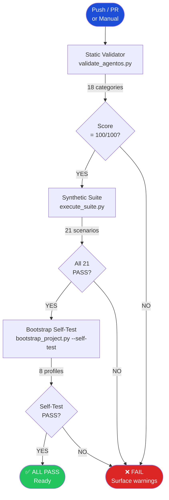

---

## 12. Artifact Lifecycle

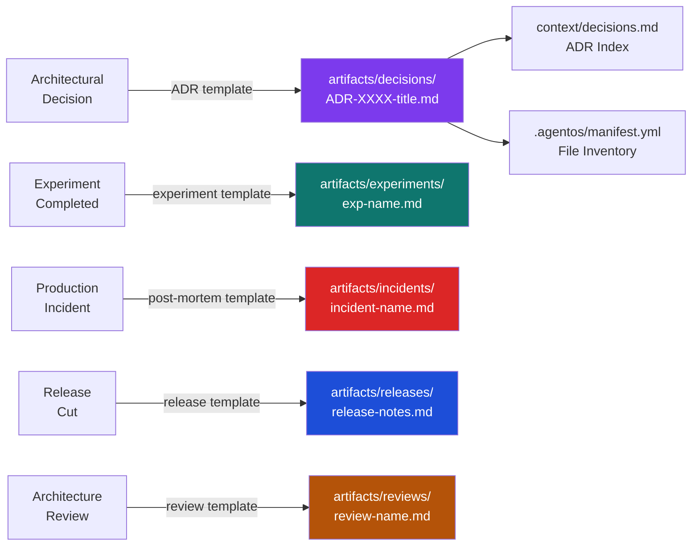

---

## 13. Repository Directory Map

```mermaid
graph TD
    Root["/ (root)"] --> A["📄 AGENTOS.md"]
    Root --> R["📄 README.md"]
    Root --> D["📄 ARCHITECTURE.md"]
    Root --> PC["⚙️ PROJECT_CONFIG.yaml"]
    Root --> MK["🔧 Makefile"]

    Root --> ctx["📁 context/"]
    ctx --> cv["vision.md"]
    ctx --> cs["state.md"]
    ctx --> ca["architecture.md"]
    ctx --> cd["decisions.md"]

    Root --> wf["📁 workflows/"]
    wf --> wm["master.md"]
    wf --> wf2["feature_development.md"]

    Root --> ag["📁 agents/"]
    ag --> ao["orchestrator.md"]
    ag --> ac["chief-architect.md"]
    ag --> ar["*-reviewer.md ×8"]

    Root --> rt["📁 runtime/"]
    rt --> rh["harness/"]
    rt --> rl["loop/"]
    rt --> rk["kernel/"]

    Root --> vl["📁 validation/"]
    vl --> vs["scenarios/ ×21"]
    vl --> vr["runner/"]

    Root --> prof["📁 profiles/ ×8"]
    Root --> ex["📁 examples/ ×5"]
    Root --> int["📁 integrations/ ×4"]
    Root --> gh["📁 .github/"]
    gh --> ghw["workflows/ ×3"]
    gh --> ghi["ISSUE_TEMPLATE/ ×3"]

    style Root fill:#1e293b,color:#fff
    style rt fill:#0f766e,color:#fff
    style vl fill:#b45309,color:#fff
```

---

## 14. Context Loading Strategy

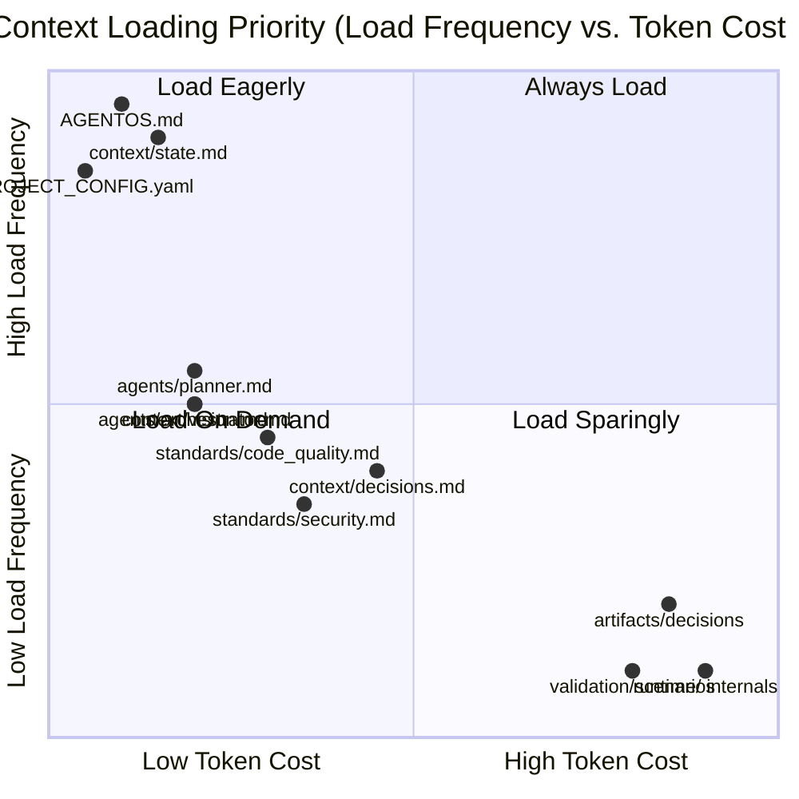

---

## 15. Release Pipeline

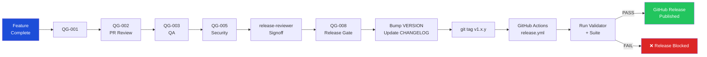

---

## 16. AI Interaction Flow

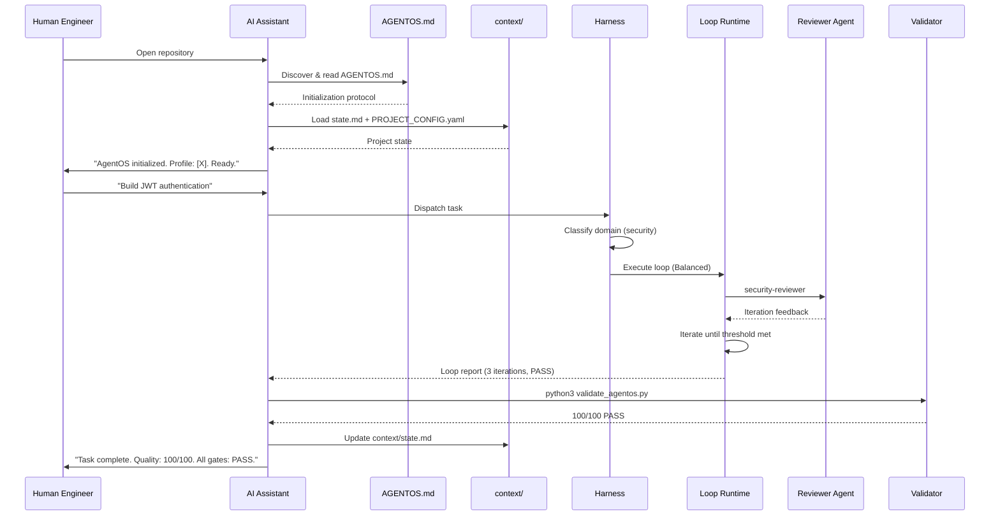

---

## 17. Documentation Cross-References

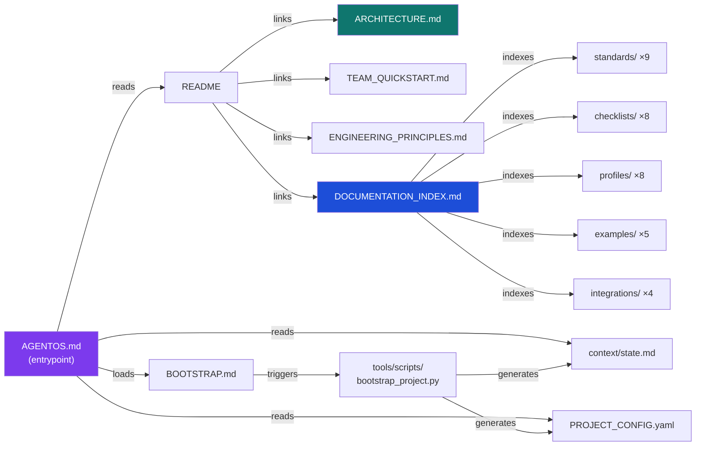

---

## 18. Decision Flow (Architectural Decision Records)

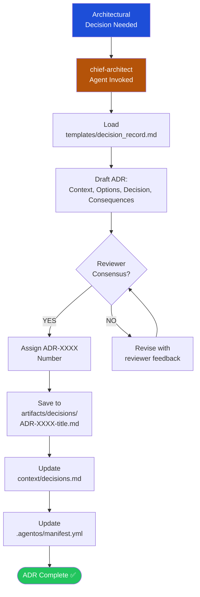

---

## 19. Escalation Flow

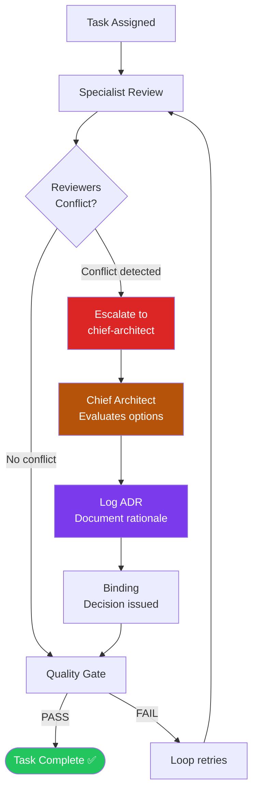

---

## 20. Runtime State Machine

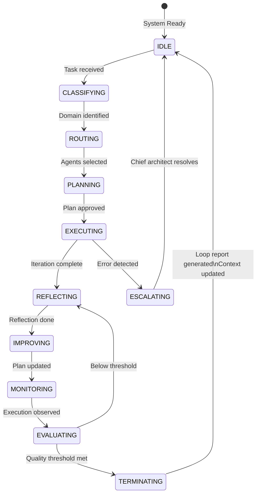

---

## 21. Synthetic Validation Flow

```mermaid
flowchart TD
    Start([execute_suite.py]) --> Manifest["Load\nvalidation/manifest.yaml"]
    Manifest --> Scenarios["21 Scenarios\nVS-001 to VS-021"]

    Scenarios --> Loop{For each\nscenario}
    Loop --> LoadScenario["Load scenario.md\ninput/ + assertions.yaml"]
    LoadScenario --> Execute["execute_scenario.py\nRun assertions"]
    Execute --> Assert{All assertions\nPASS?}

    Assert -->|YES| RecordPass["Record PASS\nScore: 100/100"]
    Assert -->|NO| RecordFail["Record FAIL\nLog reason"]

    RecordPass --> Loop
    RecordFail --> Loop

    Loop -->|Done| Report["Generate\nSuite Report"]
    Report --> Check{21/21\nPASS?}
    Check -->|YES| Success(["✅ SUCCESS\n100% coverage"])
    Check -->|NO| Failure(["❌ FAILURE\nSurface broken scenarios"])

    style Start fill:#1d4ed8,color:#fff
    style Success fill:#22c55e,color:#fff
    style Failure fill:#dc2626,color:#fff
```

---

*AgentOS v1.0.0 — Architecture diagrams. All diagrams render on GitHub using Mermaid.*
